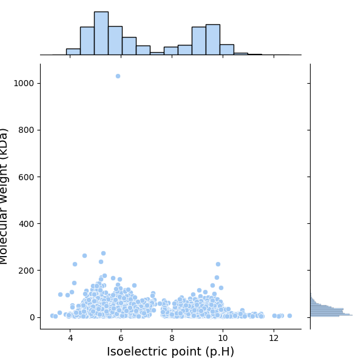
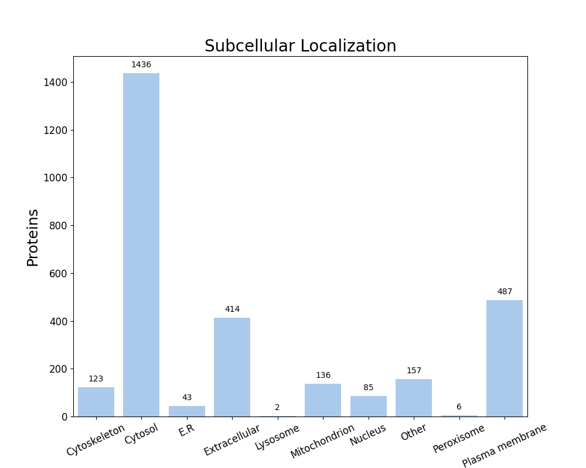

FastProtein Software 1.0
========================
##### Protein Information Software

---
### Summary
| Information                          | Value              |
| ------------------------------------ | ------------------ |
| Processed proteins                   | 2889               |
| Molecular mass (kda) mean            | 31.16 &#177; 30.41 |
| Isoelectric point mean               | 6.97 &#177; 2.00   |
| Hydrophicity mean                    | -0.16 &#177; 0.57  |
| Aromaticity mean                     | 0.10 &#177; 0.04   |
| Proteins with TM                     | 715                |
| Proteins with SP                     | 291                |
| Proteins with GPI                    | 18                 |
| Membrane proteins                    | 730                |
| Proteins with E.R Retention domains  | 342                |
| Proteins with NGlycosylation domains | 1939               |
### Molecular mass (kDa) vs Isoelectric point (pH)

---
### Subcellular localization (by WolfPSort) - Organism: animal

| Subcellular localization | Proteins |
| ------------------------ | -------- |
| Cytosol                  | 1436     |
| Plasma membrane          | 487      |
| Extracellular            | 414      |
| Other                    | 157      |
| Mitochondrion            | 136      |
| Cytoskeleton             | 123      |
| Nucleus                  | 85       |
| E.R                      | 43       |
| Peroxisome               | 6        |
| Lysosome                 | 2        |
---
### E.R Retention domain summary
| Domain | Quantity |
| ------ | -------- |
| QNEL   | 15       |
| KEEL   | 40       |
| KDEL   | 35       |
| ADEL   | 22       |
| AEEL   | 29       |
| KNEL   | 22       |
| ANEL   | 23       |
| SDEL   | 25       |
| RDEL   | 20       |
| QDEL   | 16       |
Only top 10

---
### NGlyc domain summary
| Domain | Quantity |
| ------ | -------- |
| NAT    | 192      |
| NAS    | 178      |
| NLS    | 215      |
| NKT    | 181      |
| NLT    | 228      |
| NKS    | 182      |
| NIT    | 198      |
| NIS    | 273      |
| NVS    | 195      |
| NVT    | 233      |
Only top 10

---
| Id     | Length |  kDa   | Isoelectric_Point | Hydropathy | Aromaticity |  Localization   | TMHMM_2 | Phobius_TM | PredGPI | Membrane_evidences | Membrane_evidences_detail |  SignalP5   | Phobius_SP | ER_Retention_Total | NGlyc_Total | ER_Retention_Domains |                                                                                                                                                                                                                        NGlyc_Domains                                                                                                                                                                                                                         |                           Header                           | Local_alignment_description | Gene_Ontology | Interpro_Annotation | PFAM_Annotation | Panther_Annotation |
| ------ |:------:|:------:|:-----------------:|:----------:|:-----------:|:---------------:|:-------:|:----------:|:-------:|:------------------:|:-------------------------:|:-----------:|:----------:|:------------------:|:-----------:|:--------------------:|:------------------------------------------------------------------------------------------------------------------------------------------------------------------------------------------------------------------------------------------------------------------------------------------------------------------------------------------------------------------------------------------------------------------------------------------------------------:|:----------------------------------------------------------:| --------------------------- | ------------- | ------------------- | --------------- | ------------------ |
| O33599 |  316   | 34.32  |       6.16        |   -0.94    |    0.12     |  Extracellular  |    0    |     0      |    -    |         0          |                           | SP(Sec/SPI) |     Y      |         0          |      3      |                      |                                                                                                                                                                                                            NGS[101-104];NGT[166-169];NST[285-288]                                                                                                                                                                                                            |             Glycyl-glycine endopeptidase LytM              | -                           |               |                     |                 |                    |
| O52582 |  438   | 49.24  |       5.35        |   -0.32    |    0.09     |  Mitochondrion  |    0    |     0      |    -    |         0          |                           |      -      |     Y      |         0          |      1      |                      |                                                                                                                                                                                                                         NDT[311-314]                                                                                                                                                                                                                         |               Coenzyme A disulfide reductase               | -                           |               |                     |                 |                    |
| P02976 |  516   | 56.44  |       5.54        |   -1.16    |    0.04     |  Mitochondrion  |    0    |     1      |    Y    |         2          |    GPI&#124;PHOBIUS_TM    |      -      |     Y      |         0          |      5      |                      |                                                                                                                                                                                                NDS[85-88];NES[146-149];NES[204-207];NLT[289-292];NGT[437-440]                                                                                                                                                                                                |             Immunoglobulin G-binding protein A             | -                           |               |                     |                 |                    |
| P14738 |  1018  | 111.78 |       4.64        |   -0.93    |    0.06     | Plasma membrane |    0    |     1      |    -    |         2          |    PHOBIUS_TM&#124;SL     |      -      |     Y      |         0          |     13      |                      |                                                                                                                                              NKT[54-57];NAT[76-79];NAT[85-88];NNT[211-214];NGS[266-269];NQT[316-319];NGS[348-351];NTT[415-418];NMS[428-431];NGS[438-441];NGT[462-465];NQS[749-752];NQS[787-790]                                                                                                                                              |               Fibronectin-binding protein A                | -                           |               |                     |                 |                    |
| P69848 |  340   | 39.08  |       6.18        |   -0.34    |    0.09     |     Cytosol     |    0    |     0      |    -    |         0          |                           |      -      |     -      |         1          |      1      |     KNEL[45-49]      |                                                                                                                                                                                                                         NVS[123-126]                                                                                                                                                                                                                         |                      GTP 3',8-cyclase                      | -                           |               |                     |                 |                    |
| Q2FUW1 |  2271  | 228.04 |       4.19        |   -0.54    |    0.02     |     Nucleus     |    0    |     1      |    -    |         1          |        PHOBIUS_TM         |      -      |     -      |         0          |     33      |                      | NQS[55-58];NST[110-113];NSS[129-132];NST[154-157];NTT[174-177];NTS[195-198];NQS[199-202];NNT[205-208];NKT[219-222];NAT[274-277];NKS[306-309];NTS[368-371];NNT[424-427];NIS[453-456];NFS[465-468];NYT[538-541];NDT[551-554];NKT[554-557];NQT[582-585];NGT[601-604];NKS[648-651];NNT[712-715];NKT[737-740];NSS[854-857];NST[1196-1199];NST[1252-1255];NQS[1395-1398];NST[1410-1413];NNS[1513-1516];NDS[1711-1714];NST[1926-1929];NSS[2102-2105];NGT[2218-2221] |             Serine-rich adhesin for platelets              | -                           |               |                     |                 |                    |
| Q2FV54 |  603   | 69.10  |       9.52        |    0.22    |    0.13     | Plasma membrane |    0    |     11     |    -    |         2          |    PHOBIUS_TM&#124;SL     |      -      |     -      |         0          |      0      |                      |                                                                                                                                                                                                                                                                                                                                                                                                                                                              |                  O-acetyltransferase OatA                  | -                           |               |                     |                 |                    |
| Q2FV64 |  802   | 86.74  |       5.82        |    0.11    |    0.05     | Plasma membrane |    0    |     8      |    -    |         2          |    PHOBIUS_TM&#124;SL     |      -      |     -      |         0          |      7      |                      |                                                                                                                                                                                   NLT[37-40];NAT[101-104];NLT[105-108];NGS[247-250];NGT[367-370];NQT[513-516];NYS[607-610]                                                                                                                                                                                   |               Copper-exporting P-type ATPase               | -                           |               |                     |                 |                    |
| Q2FV99 |  206   | 23.54  |       8.85        |   -0.79    |    0.08     |  Extracellular  |    0    |     0      |    -    |         0          |                           |      -      |     Y      |         0          |      3      |                      |                                                                                                                                                                                                            NES[106-109];NIS[113-116];NET[147-150]                                                                                                                                                                                                            |                         Sortase A                          | -                           |               |                     |                 |                    |
| Q2FVE7 |  532   | 60.08  |       8.62        |   -0.82    |    0.08     |  Mitochondrion  |    0    |     0      |    -    |         0          |                           | SP(Sec/SPI) |     Y      |         0          |      3      |                      |                                                                                                                                                                                                            NGT[176-179];NVT[329-332];NQT[427-430]                                                                                                                                                                                                            |          Metal-staphylopine-binding protein CntA           | -                           |               |                     |                 |                    |
| Q2FVN3 |  148   | 17.44  |       8.46        |   -0.53    |    0.11     |     Cytosol     |    0    |     0      |    -    |         0          |                           |      -      |     -      |         0          |      1      |                      |                                                                                                                                                                                                                         NIS[120-123]                                                                                                                                                                                                                         |          HTH-type transcriptional regulator SarZ           | -                           |               |                     |                 |                    |
| Q2FVT1 |  419   | 46.79  |       4.93        |    0.09    |    0.10     | Plasma membrane |    0    |     8      |    -    |         2          |    PHOBIUS_TM&#124;SL     |      -      |     -      |         0          |      5      |                      |                                                                                                                                                                                               NTT[168-171];NHT[282-285];NDT[312-315];NQT[339-342];NDS[373-376]                                                                                                                                                                                               |              Lysostaphin resistance protein A              | -                           |               |                     |                 |                    |
| Q2FWC5 |  397   | 45.65  |       5.12        |   -0.54    |    0.13     |      Other      |    0    |     0      |    -    |         0          |                           |      -      |     -      |         1          |      3      |    ANEL[315-319]     |                                                                                                                                                                                                             NLT[8-11];NTT[256-259];NGS[306-309]                                                                                                                                                                                                              |              L-aspartate--L-methionine ligase              | -                           |               |                     |                 |                    |
| Q2FXF4 |  284   | 32.51  |       9.25        |   -0.60    |    0.12     |  Extracellular  |    0    |     1      |    -    |         1          |        PHOBIUS_TM         |      -      |     -      |         0          |      3      |                      |                                                                                                                                                                                                              NVT[48-51];NYT[61-64];NAT[251-254]                                                                                                                                                                                                              |                    Glucosaminidase SagB                    | -                           |               |                     |                 |                    |
| Q2FXM8 |  322   | 34.84  |       5.63        |   -0.16    |    0.06     |     Cytosol     |    0    |     0      |    -    |         0          |                           |      -      |     -      |         0          |      1      |                      |                                                                                                                                                                                                                         NGT[132-135]                                                                                                                                                                                                                         |            ATP-dependent 6-phosphofructokinase             | -                           |               |                     |                 |                    |
| Q2FXS9 |  106   | 11.69  |       4.27        |   -0.25    |    0.06     | Plasma membrane |    0    |     0      |    -    |         1          |            SL             |      -      |     -      |         0          |      0      |                      |                                                                                                                                                                                                                                                                                                                                                                                                                                                              |         Ribosomal processing cysteine protease Prp         | -                           |               |                     |                 |                    |
| Q2FZ08 |  519   | 58.51  |       5.18        |   -0.52    |    0.02     |       E.R       |    0    |     0      |    -    |         0          |                           | SP(Sec/SPI) |     Y      |         0          |      1      |                      |                                                                                                                                                                                                                         NET[394-397]                                                                                                                                                                                                                         |                       Ribonuclease Y                       | -                           |               |                     |                 |                    |
| Q2FZE6 |  292   | 33.27  |       9.36        |   -0.44    |    0.08     |  Extracellular  |    0    |     0      |    -    |         0          |                           | SP(Sec/SPI) |     Y      |         0          |      0      |                      |                                                                                                                                                                                                                                                                                                                                                                                                                                                              |       High-affinity heme uptake system protein IsdE        | -                           |               |                     |                 |                    |
| Q2FZE9 |  350   | 38.75  |       9.64        |   -0.82    |    0.06     |  Mitochondrion  |    0    |     1      |    -    |         1          |        PHOBIUS_TM         |      -      |     Y      |         0          |      6      |                      |                                                                                                                                                                                          NAT[51-54];NQS[55-58];NAS[108-111];NHS[231-234];NKS[288-291];NET[300-303]                                                                                                                                                                                           |        Iron-regulated surface determinant protein A        | -                           |               |                     |                 |                    |
| Q2FZL2 |  336   | 36.33  |       4.99        |   -0.84    |    0.06     |  Mitochondrion  |    0    |     0      |    -    |         0          |                           | SP(Sec/SPI) |     Y      |         0          |      2      |                      |                                                                                                                                                                                                                  NIT[195-198];NNS[327-330]                                                                                                                                                                                                                   |                   Glutamyl endopeptidase                   | -                           |               |                     |                 |                    |
| Q2FZP6 |  493   | 54.10  |       5.38        |   -0.17    |    0.08     |     Cytosol     |    0    |     0      |    -    |         0          |                           |      -      |     -      |         0          |      5      |                      |                                                                                                                                                                                                NVT[74-77];NET[142-145];NTT[150-153];NLT[199-202];NIS[300-303]                                                                                                                                                                                                | UDP-N-acetylmuramoyl-L-alanyl-D-glutamate--L-lysine ligase | -                           |               |                     |                 |                    |
| Q2FZP8 |  396   | 44.62  |       9.55        |    0.95    |    0.15     | Plasma membrane |    0    |     12     |    -    |         2          |    PHOBIUS_TM&#124;SL     |      -      |     -      |         0          |      3      |                      |                                                                                                                                                                                                            NVS[239-242];NRS[269-272];NNT[366-369]                                                                                                                                                                                                            |          Proton-coupled antiporter flippase LtaA           | -                           |               |                     |                 |                    |
| Q2FZQ3 |  256   | 28.02  |       5.64        |   -0.14    |    0.07     |     Cytosol     |    0    |     0      |    -    |         0          |                           |      -      |     -      |         0          |      1      |                      |                                                                                                                                                                                                                           NKT[5-8]                                                                                                                                                                                                                           |    Enoyl-[acyl-carrier-protein] reductase [NADPH] FabI     | -                           |               |                     |                 |                    |
| Q2FZV7 |  402   | 44.10  |       5.35        |   -0.18    |    0.08     |     Cytosol     |    0    |     0      |    -    |         0          |                           |      -      |     -      |         1          |      0      |    SEEL[210-214]     |                                                                                                                                                                                                                                                                                                                                                                                                                                                              |            Type II NADH:quinone oxidoreductase             | -                           |               |                     |                 |                    |
| Q2G015 |  927   | 96.45  |       3.62        |   -1.07    |    0.03     | Plasma membrane |    0    |     1      |    -    |         2          |    PHOBIUS_TM&#124;SL     |      -      |     Y      |         1          |     23      |    AEEL[137-141]     |                                                                             NES[51-54];NDS[56-59];NVS[71-74];NAT[104-107];NQT[142-145];NET[146-149];NDT[151-154];NST[164-167];NVS[170-173];NES[186-189];NTS[206-209];NVT[237-240];NVT[348-351];NKT[361-364];NLS[376-379];NNT[390-393];NTS[429-432];NIT[462-465];NGS[530-533];NDS[624-627];NGT[872-875];NAS[875-878];NTS[899-902]                                                                             |                     Clumping factor A                      | -                           |               |                     |                 |                    |
| Q2G028 |  434   | 47.12  |       4.55        |   -0.20    |    0.08     |  Cytoskeleton   |    0    |     0      |    -    |         0          |                           |      -      |     -      |         0          |      0      |                      |                                                                                                                                                                                                                                                                                                                                                                                                                                                              |                          Enolase                           | -                           |               |                     |                 |                    |
##### Only top 10 proteins

---

##### Do you have a question or tips? Please contact us! E-mail: renato.simoes@ifsc.edu.br
Generated time: Sat Apr 04 14:30:32 UTC 2026